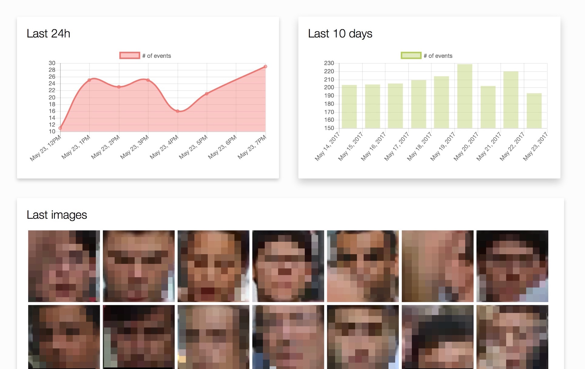
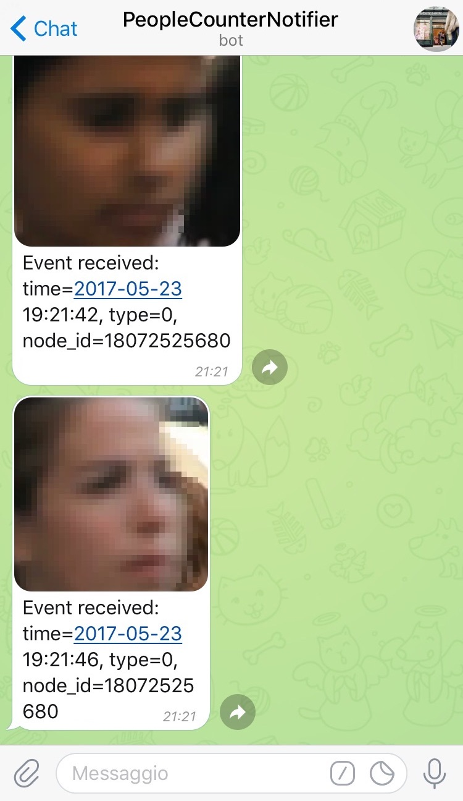

# CountMeIn
CountMeIn is a simple application that detects motion near doors and entrances with IoT devices (clients) and publishes the event to a server via a RESTful HTTP API. Use cases for CountMeIn are **people counting** in stores and **surveillance**.

The [Camera Node](clients/camera_node.py) client detects and tracks faces from a live webcam stream, then sends the face to the server as soon as it moves out the camera.

CountMeIn's server is easily extensible through plugins that are notified as soon as an event is published to the server. For instance, the **Emotion Detection Plugin** exploits Microsoft APIs to enrich an event generated by a camera with information about the gender, age and emotions. The **Telegram Bot Plugin**, instead, forwards all the events to a chat. To use these services, you must set API keys in the [configuration file](counterserver/config.cfg).

<p align="center">
  
  

## Installation and running
The easiest way to run the server is to install [Docker](https://www.docker.com/) and follow the instructions under "With Docker".

### With Docker
Build and run the multi-container application with:
```sh
$ docker-compose up
```

### Without Docker
Otherwise, you need to install [OpenCV 3.2.0 with extra modules](https://github.com/opencv/opencv_contrib/tree/3.2.0) and Python 3 bindings. Also, you need to install the required Python packages:
```sh
$ pip3 install -U gunicorn hug telepot pymongo cognitive_face yapsy jinja2
```

Now you can run the application on a development server with:
```sh
$ python3 -m counterserver
```

Or using gunicorn web server:
```sh
$ pip3 install gunicorn
$ gunicorn --reload --bind=0.0.0.0:8000 counterserver.__main__:__hug_wsgi__
```

## Testing the server is running
Try to create an event with the command:
```sh
$ curl -i http://localhost:8000/v1/events -F event_type=0
```
You should get a `201 Created` response. You can browse http://localhost:8000/ to see the dashboard.


Now try this API endpoint to get the list of face locations in an image:
```sh
$ wget https://static.pexels.com/photos/109919/pexels-photo-109919.jpeg -O test_crowd.jpg
$ curl -i $ curl -i http://localhost:8000/v1/frame -F event_image=@test_crowd.jpg
```

## Testing the Camera Node client
This command will start capturing from your webcam:
```sh
$ python3 clients/camera_node.py
```

## License
This project is licensed under the terms of the GNU General Public License v3.0.
